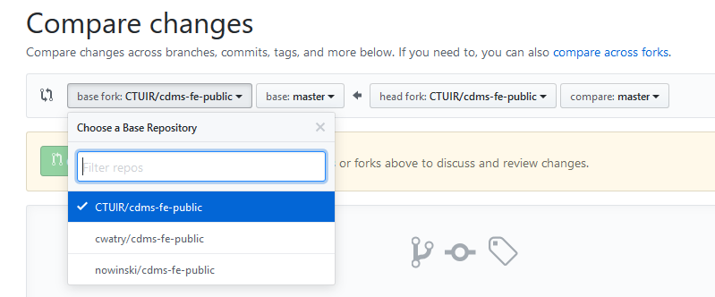

Git pull request to a private repo from a public repo
=====================================================

Our tribal organization has a private repository on `GitHub <github.com>`_ and has `a public fork <https://github.com/CTUIR/cdms-fe-public>`_ that we share as an open source project with other tribes in the Pacific Northwest. Inevitably, there are features and bug fixes happening in both repositories that we want to share in both directions. 

However, according to github tech support, it isn't possible to create a PR across that public/private boundary. When I try to compare across forks, sure enough, only the public repositories show up.

I realized this might still be accomplished by simply making a branch in the private repo based on my public master. Then I could do a PR in our private repo between the new branch and master.

Here are the steps:

1. From your private repository: 
    ``git checkout master``
2. Add your public remote: 
    ``git remote add public_cdms_fe https://github.com/CTUIR/cdms-fe-public.git``
3. Now fetch the remote branch into a new local branch: 
    ``git fetch tribal_cdms_fe master:my_new_branch``

This will create a branch in your local private repo from the public repo master. Most likely, you'll usually want to cherry-pick your changes rather making a PR that includes them all. Now that you've fetched the commits from the public master, you can create yet another new branch based on your private master and then cherry-pick the commits you want and then create a PR from that new branch. 

For example:

1. From your private master branch create a new branch: ``git checkout -b tribal_cherrypicks``
2. ``git cherry-pick COMMITID`` (note: you can get the COMMITID from "git log")
3. Once you have all the commits you want, do your commit and then push your new branch up to github and then create a PR.

.. author:: default
.. categories:: none
.. tags:: none
.. comments::
